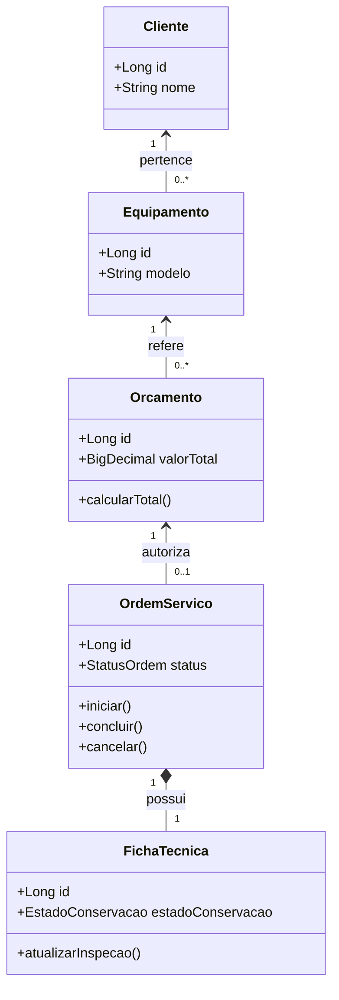
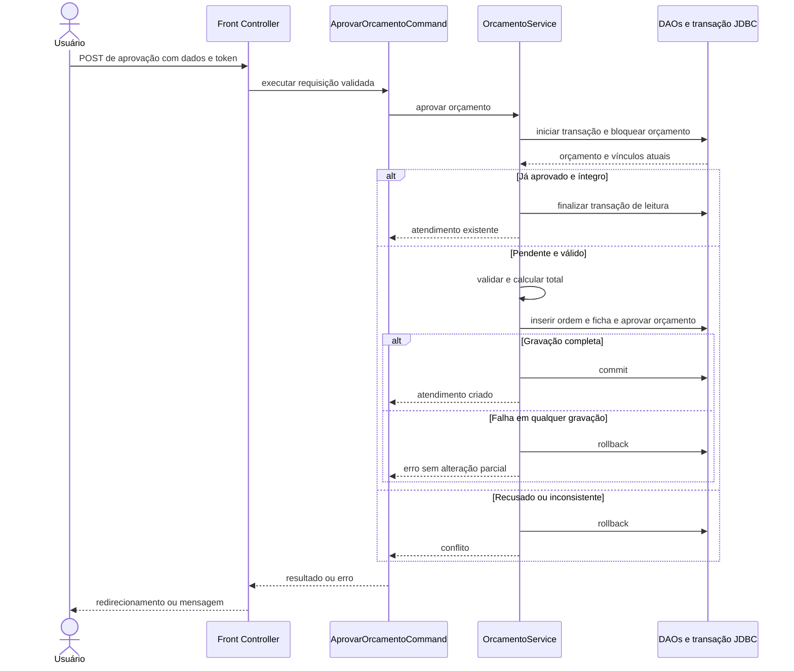

# Sistema de assistência técnica

## 1. Identificação e objetivo

- **Disciplina:** Padrões de Projeto, Engenharia de Software.
- **Avaliação:** M1, projeto com peso de 30% e teto de 3,0 pontos.
- **Grupo:** até três integrantes; preencher nomes e matrículas.
- **Apresentação:** 29/09/2026, às 19h10 (GMT−3), laboratório 2T27, conforme as especificações fornecidas.
- **Estado deste documento:** especificação proposta para desenvolvimento e aprovação do professor. As funcionalidades e os testes descritos ainda não foram implementados ou executados.

Desenvolver uma aplicação web para uma assistência técnica fictícia. O sistema gerenciará clientes, equipamentos, orçamentos, ordens de serviço e fichas técnicas. A aprovação de um orçamento deverá gerar automaticamente uma ordem e sua ficha, com validação, cálculo financeiro e proteção contra duplicidade.

## 2. Correções incorporadas

1. Inclusão de `FichaTecnica`, obrigatória e exclusiva para cada `OrdemServico`, para atender diretamente ao requisito **1:1**.
2. Preservação da associação opcional entre orçamento e ordem: um orçamento pendente ou recusado não precisa ter ordem.
3. Criação e exclusão de ordem e ficha sempre em conjunto, evitando registros sem o respectivo par.
4. Definição das situações em que exclusão física é permitida e das situações que exigem cancelamento.
5. Separação entre URL e parâmetros do corpo nas operações HTTP POST.
6. Classificação explícita de `CommandFactory` como **fábrica simples**, conforme a abordagem de `PessoaFactory` da aula. Não será apresentada como Factory Method GoF.

## 3. Escopo

### Incluído

- Cinco entidades, cada uma com dez atributos persistidos ou referências persistidas.
- Inserir, excluir, atualizar, consultar por ID e consultar todos.
- Relacionamentos 1:N e 1:1 com navegação nas telas.
- Aprovação automática de orçamento com geração de ordem e ficha.
- MVC, DAO, Command, Builder, fábrica simples e Front Controller.
- Validações, medidas de segurança, documentação e testes.
- Execução local para apresentação, com dados inteiramente fictícios.

### Fora do escopo inicial

- Emissão fiscal, pagamentos reais, estoque e integração com serviços externos.
- Envio de e-mail, WhatsApp ou notificações externas.
- Cadastro de funcionários e autenticação com perfis de acesso.
- Publicação pública. A demonstração será local; CSRF e validações não substituem autenticação e autorização para um uso compartilhado futuro.

## 4. Requisitos funcionais

| Código | Requisito | Critério de aceite |
| --- | --- | --- |
| RF01 | Gerenciar clientes | Realizar as cinco operações de cadastro e respeitar CPF único e dependências. |
| RF02 | Gerenciar equipamentos | Realizar o CRUD e exigir um cliente existente. |
| RF03 | Gerenciar orçamentos | Realizar o CRUD, vincular equipamento e calcular valores no servidor. |
| RF04 | Gerenciar ordens | Inserir pela aprovação do orçamento; consultar, listar, atualizar e excluir conforme o estado. |
| RF05 | Aprovar orçamento | Aprovar e criar ordem e ficha na mesma transação, sem duplicidade. |
| RF06 | Navegar pelos vínculos | Exibir equipamentos do cliente, orçamentos do equipamento e ordem/ficha do atendimento. |
| RF07 | Gerenciar fichas | Inserir e excluir junto com a ordem; consultar por ID, listar e atualizar separadamente. |

**Semântica do CRUD:** o formulário “Inserir ordem” seleciona um orçamento pendente e coleta dados da ordem e da ficha. Ao confirmar, chama o mesmo serviço de aprovação automática. A ficha não possui criação ou exclusão isolada: essas operações existem no ciclo de vida conjunto do atendimento. Isso deve constar na proposta submetida ao professor.

## 5. Entidades e atributos

Os nomes abaixo representam atributos Java. No banco, as referências serão chaves estrangeiras. IDs serão gerados pelo banco. CPF, número de endereço e número de série são textos, preservando zeros e caracteres. Listas derivadas de navegação não entram na contagem de dez atributos.

### Cliente

| Atributo | Tipo Java | Regra |
| --- | --- | --- |
| id | Long | Identificador gerado. |
| nome | String | Obrigatório, até 120 caracteres. |
| cpf | String | Dado fictício, 11 dígitos normalizados, único. |
| email | String | Opcional, até 254 caracteres; validar formato quando informado. |
| telefone | String | Obrigatório, até 20 caracteres. |
| logradouro | String | Obrigatório, até 150 caracteres. |
| numero | String | Obrigatório, até 20 caracteres. |
| bairro | String | Obrigatório, até 80 caracteres. |
| cidade | String | Obrigatório, até 80 caracteres. |
| dataCadastro | LocalDateTime | Gerada pelo servidor, não editável. |

### Equipamento

| Atributo | Tipo Java | Regra |
| --- | --- | --- |
| id | Long | Identificador gerado. |
| cliente | Cliente | Referência obrigatória a cliente existente. |
| tipo | String | Obrigatório, até 60 caracteres. |
| marca | String | Obrigatório, até 60 caracteres. |
| modelo | String | Obrigatório, até 80 caracteres. |
| numeroSerie | String | Opcional, até 100 caracteres. |
| cor | String | Opcional, até 40 caracteres. |
| voltagem | String | Valor permitido: 110V, 127V, 220V, BIVOLT ou NAO_APLICAVEL. |
| descricao | String | Opcional, até 1000 caracteres. |
| dataCadastro | LocalDateTime | Gerada pelo servidor, não editável. |

### Orcamento

| Atributo | Tipo Java | Regra |
| --- | --- | --- |
| id | Long | Identificador gerado. |
| equipamento | Equipamento | Referência obrigatória a equipamento existente. |
| descricaoProblema | String | Obrigatória, até 2000 caracteres. |
| diagnostico | String | Até 2000 caracteres; obrigatório para aprovar. |
| valorPecas | BigDecimal | Não negativo; duas casas decimais. |
| valorMaoDeObra | BigDecimal | Não negativo; duas casas decimais. |
| percentualDesconto | BigDecimal | Entre 0 e 100; até duas casas decimais. |
| valorTotal | BigDecimal | Calculado pelo servidor; não aceitar valor do formulário. |
| status | StatusOrcamento | PENDENTE, APROVADO ou RECUSADO. |
| dataCriacao | LocalDateTime | Gerada pelo servidor, não editável. |

### OrdemServico

| Atributo | Tipo Java | Regra |
| --- | --- | --- |
| id | Long | Identificador gerado. |
| orcamento | Orcamento | Referência obrigatória e única. |
| responsavel | String | Nome fictício obrigatório, até 120 caracteres. |
| prioridade | Prioridade | BAIXA, NORMAL ou ALTA. |
| status | StatusOrdem | ABERTA, EM_ANDAMENTO, CONCLUIDA ou CANCELADA. |
| dataAbertura | LocalDateTime | Gerada pelo servidor. |
| previsaoConclusao | LocalDateTime | Opcional; não anterior à abertura. |
| dataConclusao | LocalDateTime | Nula até concluir; preenchida pelo servidor ao concluir. |
| observacoes | String | Opcional, até 2000 caracteres. |
| prazoGarantiaDias | Integer | Não negativo. Apenas informação acadêmica, sem regra legal implementada. |

### FichaTecnica

| Atributo | Tipo Java | Regra |
| --- | --- | --- |
| id | Long | Identificador gerado. |
| ordemServico | OrdemServico | Referência obrigatória e única. |
| estadoConservacao | EstadoConservacao | NAO_AVALIADO, BOM, REGULAR ou RUIM. |
| acessoriosEntregues | String | Até 1000 caracteres; pode registrar “Nenhum”. |
| ligaNormalmente | Boolean | Aceita nulo para “Não verificado”; não confundir com falso. |
| possuiAvarias | Boolean | Aceita nulo para “Não verificado”. |
| descricaoAvarias | String | Até 2000 caracteres; obrigatória quando possuiAvarias=true. |
| testeInicial | String | Até 2000 caracteres; pode iniciar como “Não realizado”. |
| observacoesRecebimento | String | Opcional, até 2000 caracteres. |
| dataRegistro | LocalDateTime | Gerada pelo servidor. |

## 6. Relacionamentos e integridade

| Associação | Multiplicidade | Garantia |
| --- | --- | --- |
| Cliente → Equipamento | 1 para 0..N | Cada equipamento tem cliente_id obrigatório e chave estrangeira. |
| Equipamento → Orcamento | 1 para 0..N | Cada orçamento tem equipamento_id obrigatório e chave estrangeira. |
| Orcamento → OrdemServico | 1 para 0..1 | orcamento_id em ordem_servico é NOT NULL, UNIQUE e chave estrangeira. |
| OrdemServico ↔ FichaTecnica | 1 para 1 | ordem_servico_id na ficha é NOT NULL, UNIQUE e chave estrangeira; serviço cria e remove o par na mesma transação. |

**Limite da restrição SQL:** NOT NULL, UNIQUE e chave estrangeira garantem que toda ficha aponta para uma ordem e que uma ordem tem no máximo uma ficha. A obrigação de toda ordem possuir ficha será garantida pelo fluxo transacional e pela ausência de operações de criação isolada. Escritas diretas fora da aplicação podem violar essa última regra; o usuário do banco será reservado à aplicação e os testes verificarão a invariante após cada operação.

Regras adicionais:

- Não permitir alteração de cliente do equipamento quando este já possuir orçamento.
- Não permitir alteração de equipamento ou valores de orçamento aprovado ou recusado.
- Não permitir trocar orçamento de uma ordem nem ordem de uma ficha.
- Chaves estrangeiras devem impedir exclusão de cliente com equipamentos e equipamento com orçamentos.
- Excluir orçamento somente se PENDENTE ou RECUSADO e sem ordem.
- Excluir fisicamente ordem somente se ABERTA. Excluir primeiro sua ficha, depois a ordem e retornar o orçamento a PENDENTE na mesma transação.
- Cancelamento mantém ordem, ficha e orçamento aprovado para consulta histórica.
- Editar dados da ficha e os campos operacionais da ordem apenas em ABERTA ou EM_ANDAMENTO.
- Não expor endpoints que alterem diretamente status ignorando as transições abaixo.

### Estados

| Entidade | Origem | Destino | Condição |
| --- | --- | --- | --- |
| Orcamento | PENDENTE | APROVADO | Aprovação cria ordem e ficha. |
| Orcamento | PENDENTE | RECUSADO | Não pode possuir ordem. |
| Orcamento | APROVADO | PENDENTE | Somente ao excluir uma ordem ainda ABERTA e sua ficha. |
| OrdemServico | ABERTA | EM_ANDAMENTO | Início do atendimento. |
| OrdemServico | ABERTA | CANCELADA | Cancelamento preserva registros. |
| OrdemServico | EM_ANDAMENTO | CONCLUIDA | Preencher dataConclusao, não anterior à abertura. |
| OrdemServico | EM_ANDAMENTO | CANCELADA | Cancelamento preserva registros. |

CONCLUIDA e CANCELADA são estados finais. Para um novo atendimento, cadastrar novo orçamento. Orçamento RECUSADO também é final; uma nova proposta gera um novo registro.

## 7. Automação e transações

### Aprovar orçamento

1. Receber ID do orçamento e dados da ordem/ficha; validar tipos, tamanhos, opções e token CSRF.
2. Abrir conexão JDBC, iniciar transação e bloquear a linha do orçamento para atualização.
3. Consultar o orçamento. Retornar erro de inexistência se não encontrado.
4. Se já estiver APROVADO com ordem e ficha válidas, retornar o atendimento existente sem alterar os dados. Isso torna a repetição idempotente.
5. Rejeitar orçamento RECUSADO ou estado inconsistente, sem “consertar” silenciosamente os registros.
6. Validar diagnóstico e campos necessários; recalcular o total.
7. Usar o Builder para construir a ordem ABERTA e inserir, obtendo seu ID.
8. Construir e inserir a ficha vinculada. Campos ainda não verificados devem indicar essa condição explicitamente.
9. Marcar o orçamento como APROVADO e salvar o total.
10. Confirmar a transação apenas depois que todos os registros forem gravados.
11. Em qualquer falha, executar rollback. Fechar recursos em todos os caminhos.

Os DAOs envolvidos recebem o mesmo contexto de transação e não abrem conexões independentes nem fazem commit próprio. Os bloqueios e a restrição UNIQUE devem proteger também contra solicitações concorrentes. A ordem de bloqueios será orçamento, ordem e ficha para aprovação, alteração de estado e exclusão.

### Cálculo

```text
subtotal = valorPecas + valorMaoDeObra
valorTotal = subtotal * (1 - percentualDesconto / 100)
```

Usar `BigDecimal` criado de representação decimal, nunca de `double`. Persistir valores em `DECIMAL(12,2)` e o percentual em `DECIMAL(5,2)`. Limitar os valores de entrada e o resultado à capacidade das colunas. Arredondar o total uma única vez para duas casas, com `HALF_UP`.

Exemplo de aceite: peças R$ 100,00 + mão de obra R$ 50,00, com desconto de 10% → **R$ 135,00**.

### Excluir ordem aberta

Bloquear orçamento e ordem, confirmar ABERTA, excluir ficha, excluir ordem, retornar orçamento a PENDENTE e confirmar tudo junto. Em falha, restaurar integralmente os registros por rollback. Uma ordem já iniciada deve produzir conflito, sem exclusão parcial.

## 8. Arquitetura e padrões

Tecnologias propostas: Java, Servlets/JSP, JDBC, MySQL, NetBeans e Tomcat, seguindo os exemplos recebidos. Fixar as versões antes da implementação e registrá-las no README; os arquivos de aula usam configurações diferentes. A escolha definitiva deve ser compatível com a máquina da apresentação.

| Componente | Responsabilidade |
| --- | --- |
| View em JSP | Formulários, listagens, detalhes e mensagens; sem SQL. |
| FrontControllerServlet | Validar método/ação, obter o comando e encaminhar a resposta. |
| ICommand | Contrato comum de execução para as ações. |
| Comandos concretos | Interpretar entradas, chamar serviços e definir resultado da navegação. |
| CommandFactory | Fábrica simples, com lista explícita de ações permitidas. |
| Serviços | Regras, transações, estados e coordenação dos DAOs. |
| Entidades e Builders | Estado do domínio e construção validada. |
| Interfaces DAO | Contratos de persistência usados pelos serviços. |
| DAOs JDBC | Consultas parametrizadas e mapeamento entre banco e objetos. |
| Infraestrutura | Conexão, contexto transacional, configuração e logs. |

### Aplicação justificada

- **MVC:** separa apresentação, domínio e coordenação das requisições.
- **DAO:** isola SQL, permitindo testar serviços com implementações controladas dos contratos.
- **Command:** cada ação é um objeto executável através de `ICommand`; demonstra polimorfismo.
- **Builder:** constrói orçamento e ordem com muitos campos, sem construtores posicionais extensos, rejeitando objetos incompletos.
- **Fábrica simples:** centraliza a criação de comandos; novas ações são registradas na fábrica. Não prometer que ela dispensa qualquer alteração para adicionar ações.
- **Front Controller:** mantém um ponto central de entrada para as requisições da aplicação.

Abstract Factory e herança de entidades não serão adicionados sem necessidade. Herança e interfaces são mecanismos de orientação a objetos; não equivalem, por si só, a um Design Pattern.

### Organização sugerida de pacotes

| Pacote | Exemplos |
| --- | --- |
| model | Cliente, Equipamento, Orcamento, OrdemServico, FichaTecnica e enums |
| builder | OrcamentoBuilder, OrdemServicoBuilder |
| controller | FrontControllerServlet |
| command | ICommand, CadastrarClienteCommand, AprovarOrcamentoCommand |
| factory | CommandFactory |
| service | ClienteService, EquipamentoService, OrcamentoService, OrdemServicoService, FichaTecnicaService |
| dao | Interfaces ClienteDAO, EquipamentoDAO, OrcamentoDAO, OrdemServicoDAO e FichaTecnicaDAO |
| dao.jdbc | Implementações JDBC dos contratos |
| infra | Conexão, transação e configuração |
| validation | Validações reutilizáveis |
| exception | Erros de validação, inexistência e conflito |

As JSPs ficarão protegidas em `WEB-INF/views`, acessadas pelo controlador. Credenciais serão configuradas externamente, sem incluí-las no código-fonte.

## 9. Diagramas propostos

Diagramas de projeto, a atualizar conforme a implementação. O diagrama de classes abaixo representa o domínio; os atributos completos constam no dicionário da seção 5. A documentação final também deverá representar as classes dos padrões efetivamente implementados.

### Classes do domínio



### Sequência da aprovação



A obtenção do comando pela fábrica precede `executar`; foi omitida da sequência para manter o foco na transação. “DAOs e transação JDBC” agrupa a infraestrutura, não propõe uma única classe com todas as responsabilidades.

## 10. Contrato HTTP

Aplicação com renderização no servidor, não uma API REST. A rota é sempre `/controle`. Os parâmetros de GET ficam na query string. Em POST, `acao`, `id`, campos e `csrfToken` ficam no corpo `application/x-www-form-urlencoded`. Valores serão codificados pelo formulário.

### Operações

| Entidade | GET acao | POST acao |
| --- | --- | --- |
| cliente | cliente.listar, cliente.consultar | cliente.inserir, cliente.atualizar, cliente.excluir |
| equipamento | equipamento.listar, equipamento.consultar | equipamento.inserir, equipamento.atualizar, equipamento.excluir |
| orcamento | orcamento.listar, orcamento.consultar | orcamento.inserir, orcamento.atualizar, orcamento.excluir, orcamento.aprovar, orcamento.recusar |
| ordemServico | ordemServico.listar, ordemServico.consultar | ordemServico.inserir, ordemServico.atualizar, ordemServico.excluir, ordemServico.iniciar, ordemServico.concluir, ordemServico.cancelar |
| fichaTecnica | fichaTecnica.listar, fichaTecnica.consultar | fichaTecnica.atualizar |

`ordemServico.inserir` delega à aprovação, recebendo `orcamentoId`. `orcamento.aprovar` recebe `id`. Ambos executam o mesmo caso de uso e recebem os campos da ordem e da ficha. Não existem `fichaTecnica.inserir` ou `fichaTecnica.excluir` isolados.

### Entradas e saídas

| Operação | Entrada | Resultado esperado |
| --- | --- | --- |
| listar | acao; filtro de vínculo opcional | HTTP 200, lista HTML, inclusive lista vazia. |
| consultar | acao e id positivo | HTTP 200 e detalhes; 404 se inexistente. |
| inserir cliente/equipamento/orçamento | acao e campos editáveis da entidade | HTTP 303 para consultar o registro criado. |
| atualizar | acao, id e campos permitidos | HTTP 303 para detalhes após sucesso. |
| excluir | acao e id | HTTP 303 para listagem; 409 se bloqueada por estado/vínculo. |
| aprovar/inserir ordem | acao, ID do orçamento, dados da ordem e da ficha | HTTP 303 para a ordem criada ou já existente. |
| iniciar/concluir/cancelar/recusar | acao e id | HTTP 303 após a transição; 409 se inválida. |

Campos de relacionamento usam `clienteId`, `equipamentoId` e `orcamentoId` no formulário. ID gerado, datas geradas, valorTotal e status não são aceitos como campos editáveis genéricos. Campos da ficha enviados na criação usam prefixo `ficha.`, como `ficha.estadoConservacao`.

Filtros de navegação: `equipamento.listar&clienteId=...`, `orcamento.listar&equipamentoId=...`, `ordemServico.listar&orcamentoId=...` e `fichaTecnica.listar&ordemServicoId=...`.

### Erros comuns

| Código HTTP | Uso |
| --- | --- |
| 400 | Parâmetro ausente, formato inválido, campo fora do limite ou ação desconhecida. |
| 403 | Token CSRF ausente ou inválido. |
| 404 | Registro consultado inexistente. |
| 405 | Método HTTP não permitido para a ação. |
| 409 | Estado incompatível, CPF duplicado, vínculo obrigatório ou exclusão bloqueada. |
| 500 | Falha interna; mensagem genérica ao usuário e detalhes nos logs. |

Formulários com erro devem preservar entradas seguras e explicar qual campo precisa ser corrigido. Redirecionamento após POST reduz reenvios por atualização da página, mas não substitui as proteções transacionais contra duplicidade.

## 11. Qualidade, segurança e usabilidade

- Validar todas as entradas no servidor; validação no navegador é complementar.
- Usar `PreparedStatement`, inclusive para IDs. Ordenações futuras devem usar lista de colunas permitidas.
- Escapar dados de usuário nas JSPs conforme o contexto de saída.
- Validar token CSRF associado à sessão em todos os POSTs. Sessão de CSRF não implica usuário autenticado.
- Rejeitar ações desconhecidas e nomes de classes recebidos do cliente.
- Separar GET de operações de alteração e verificar o método no controlador.
- Usar `try-with-resources` para statements e resultados. A conexão transacional é fechada por seu proprietário após commit/rollback, não prematuramente pelo DAO.
- Manter credenciais fora do código e evitar privilégios administrativos para a aplicação.
- Não exibir stack traces, SQL ou credenciais nas páginas.
- Manter métodos pequenos, responsabilidades claras e dependências por contratos.
- Aplicar Object Calisthenics com justificativas: a regra literal de limitar atributos conflita com a exigência acadêmica de dez atributos por entidade. Documentar essa exceção, sem prometer conformidade integral.
- Confirmar exclusão e informar por que uma operação foi bloqueada.
- Usar status com texto, sem depender apenas de cores.
- Exibir ordem e ficha juntas na página do atendimento; identificar claramente avaliações ainda não realizadas.
- Garantir labels nos formulários e navegação por teclado.

## 12. Plano de testes e demonstração

Testes planejados; os resultados só serão preenchidos após a implementação.

| Caso | Ação | Resultado esperado |
| --- | --- | --- |
| T01 | CRUD de cliente | Operações funcionam; CPF duplicado é rejeitado. |
| T02 | CRUD de equipamento | Cliente inexistente é rejeitado; vínculo válido aparece nas consultas. |
| T03 | CRUD de orçamento | Total calculado no servidor; alteração indevida de aprovado é rejeitada. |
| T04 | Inserir ordem e ficha | Par criado ao aprovar orçamento; consulta de ambos funciona. |
| T05 | Atualizar ordem e ficha | Campos válidos são alterados; referências e estados finais são preservados. |
| T06 | Excluir ordem ABERTA | Ordem e ficha removidas; orçamento volta a PENDENTE. |
| T07 | Excluir ordem iniciada | HTTP 409 e registros preservados. |
| T08 | Dois equipamentos de um cliente | Associação 1:N demonstrada. |
| T09 | Tentar segunda ficha para mesma ordem | UNIQUE rejeita; permanece uma ficha. |
| T10 | Aprovar exemplo de R$ 150,00 com 10% | Total R$ 135,00, uma ordem e uma ficha. |
| T11 | Aprovar novamente | Retorna mesma ordem sem criar novos registros. |
| T12 | Aprovações concorrentes | Apenas uma ordem e uma ficha persistidas. |
| T13 | Falha ao inserir ficha | Rollback integral; orçamento PENDENTE sem ordem. |
| T14 | Falha no meio da exclusão | Par original preservado; orçamento permanece APROVADO. |
| T15 | Excluir cliente com equipamento | Operação bloqueada, sem apagar dependentes. |
| T16 | ID inexistente e campos inválidos | Respostas 404 ou 400 e mensagens adequadas. |
| T17 | Tentativas de SQL Injection e XSS | Entradas não executam SQL nem scripts na página. |
| T18 | POST sem token e alteração via GET | Respostas 403 e 405, sem alteração no banco. |
| T19 | Desconto 0%, 100% e acima de 100% | Totais corretos nos limites; desconto inválido rejeitado. |
| T20 | Verificar integridade após operações | Nenhuma ordem sem ficha, nenhuma ficha órfã e nenhum orçamento com duas ordens. |

Roteiro da apresentação: cadastrar cliente, cadastrar dois equipamentos, criar orçamento, aprovar, mostrar ordem e ficha, repetir aprovação, demonstrar uma alteração e uma exclusão permitida, demonstrar exclusão bloqueada e explicar o código dos padrões com os diagramas.

## 13. Entregáveis e cronograma

| Período proposto | Atividade |
| --- | --- |
| 15 a 17/09/2026 | Validar escopo, integrantes, versões e ambiente. |
| 18 a 22/09/2026 | Implementar modelo, banco, DAOs e CRUD. |
| 23 a 25/09/2026 | Implementar transações, automação, comandos, fábrica e Builders. |
| 26 a 28/09/2026 | Testar, revisar diagramas, documentar e ensaiar em ambiente de apresentação. |
| 29/09/2026 às 19h10 | Apresentar no laboratório 2T27. |

Entregar código-fonte original, script de criação do banco, dados fictícios de demonstração, README de instalação, versões das dependências, diagramas de classes e sequência, contrato HTTP e relatório de testes e vulnerabilidades. Os integrantes devem compreender e conseguir explicar as decisões e o código.

O documento da disciplina soma 6,0 pontos nos critérios, mas informa teto de 3,0 para o projeto; a conversão deve ser esclarecida com o professor. A prova individual é em 30/09/2026 às 19h10, distinta da apresentação.

## 14. Referências do projeto

- Especificações M1 5ES PP v20260909.pdf.
- Aulas 01, 02 e 03: polimorfismo com herança, classes abstratas e interfaces.
- MVC(1).docx e DAO(1).pdf.
- Aula06 - Padrões de projeto de Criação(1).pdf e exemplos de Builder.
- Aplicando Padrões - Command e Factory - Web.pdf.
- Exemplos CRUD e exercícios fornecidos pela disciplina, usados como referências didáticas, não como projeto final copiado.
